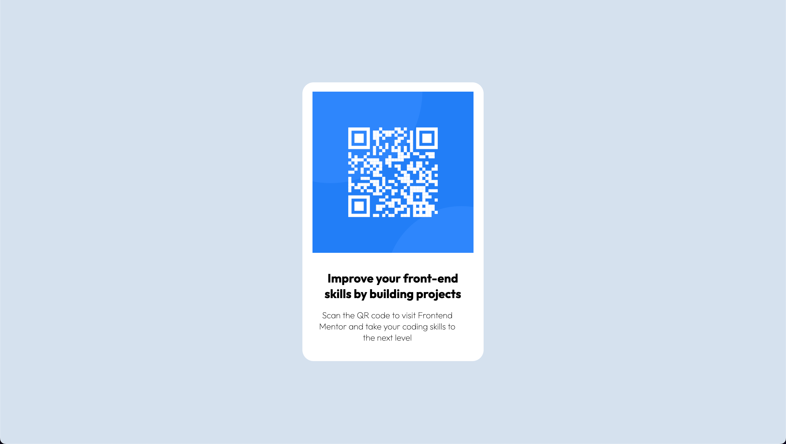

# Frontend Mentor - QR code component solution

This is a solution to the [QR code component challenge on Frontend Mentor](https://www.frontendmentor.io/challenges/qr-code-component-iux_sIO_H). Frontend Mentor challenges help you improve your coding skills by building realistic projects.

## Table of contents

- [Overview](#overview)
  - [Screenshot](#screenshot)
- [My process](#my-process)
  - [Built with](#built-with)

**Note: Delete this note and update the table of contents based on what sections you keep.**

## Overview

### Screenshot

#### Desktop View:



#### Mobile View:


### Links

- Live Site URL: [Live Demo](https://jerryren527.github.io/qr-code-component/)

## My process

### Built with

- Semantic HTML5 markup
- CSS custom properties
- Flexbox
- CSS Grid
- Mobile-first workflow

### What I learned

To position an element to be in the center of the screen, you can use the following CSS rules:

```css
.element {
  position: absolute;
  top: 50%;
  left: 50%;
  transform: translate(-50%, -50%);
}
```

- Here position the element absolutely.
- Position the top left corner of the element at the center of the screen.
- `transform: translate(-50%, -50%);` translates the element up and left by 50% of its height and width, respectively. This aligns the element's center with the center of the screen.
